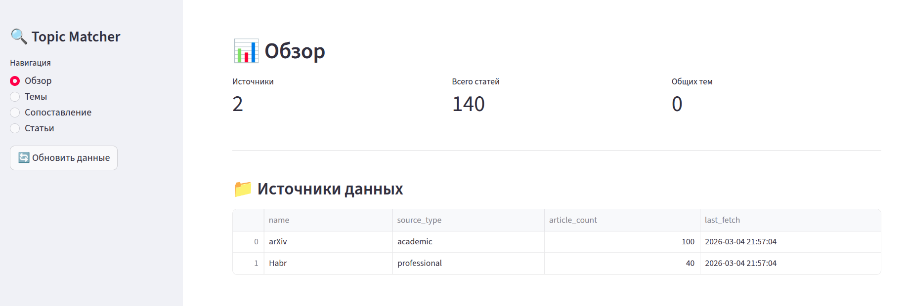
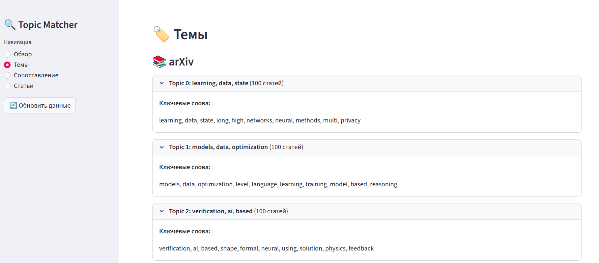
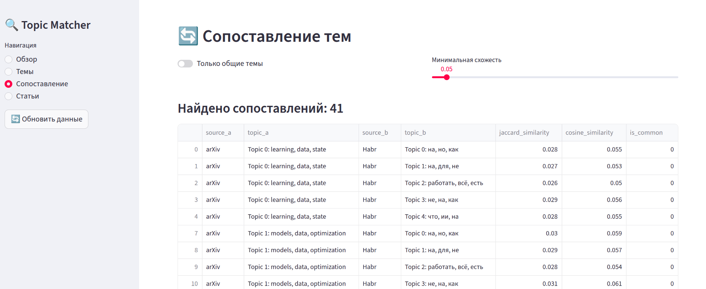
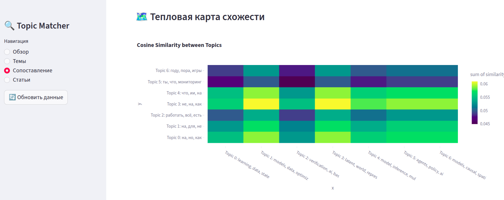

# Topic Matcher

Инструмент для сопоставления тематик из различных источников.

## Установка

```bash
poetry install
```

## Использование

```bash
# Запуск UI
poetry run python main.py ui

# Полный анализ (сбор + анализ + сравнение)
poetry run python main.py

# Отдельные команды
poetry run python main.py collect   # только сбор данных
poetry run python main.py analyze    # только анализ тем
poetry run python main.py compare    # только сравнение
```

## Скриншоты









## Тесты

```bash
poetry run pytest tests/
```
